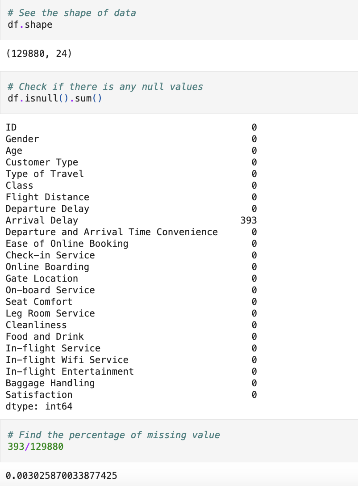
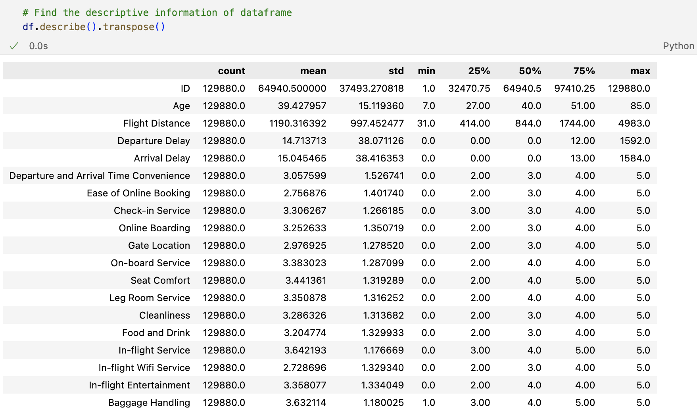
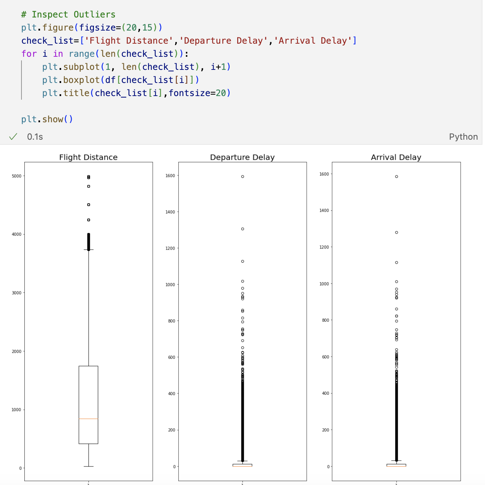
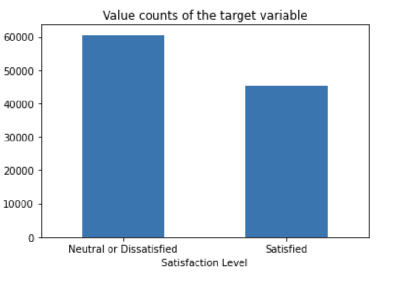
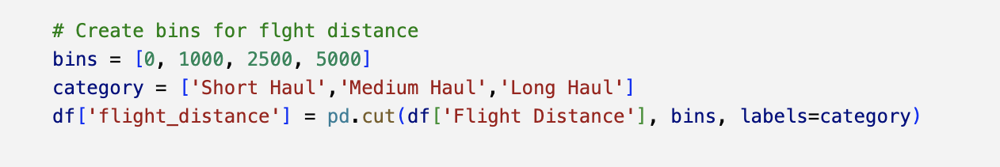
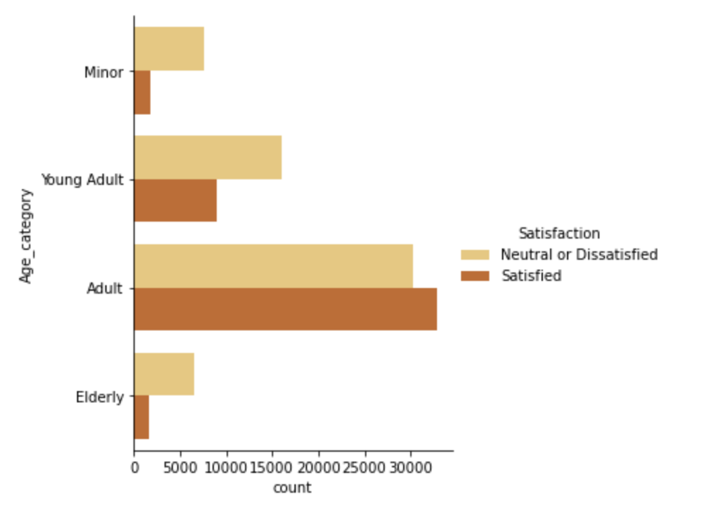
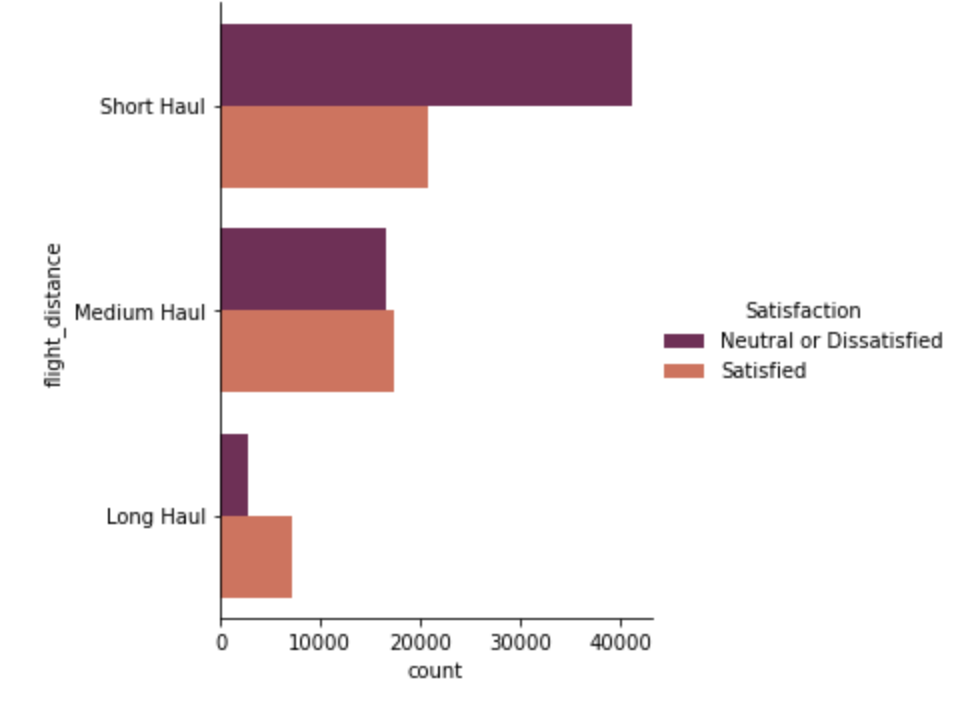
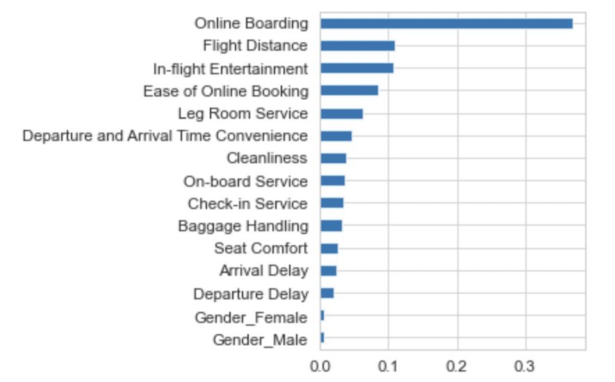

# Airlines Passenger Satisfaction
Customer satisfaction plays a crucial role in determining business performance and serves as a strategic tool for gaining a competitive edge. This study uses machine learning models to predict the overall satisfaction of passengers with the full service provided by the airline. .

## Data Source
Data used in this study is the passenger satisfaction data set of an American airline on Kaggle (https://www.kaggle.com/binaryjoker/airline-passenger-satisfaction) 

## Exploratory data analysis
The dataset contains 129880 samples. 

### Missing Values
Initial dataset contains 0.3% of missing values. I used median method to fill the missing values. 

### Outliers
Outliers can have a significant impact on machine learning models, potentially skewing results or leading to inaccurate predictions. I used .describe() from Pandas to get an overview of the distribution of the numerical features. 

From the table above, I have observed that max column values for some variables are much higher than their median value.
For example, 'Flight Distance' has median value of 844.0 and a max value of 4983.0.

Visualizing the outlier;

So, I have used  outlier removal method on three variables 'Flight Distance', 'Departure Delay' and 'Arrival Delay' in order for the model to better generalize across the full dataset.

After removing the outliers, there are 105722 samples. 

### Target variable
It is a balanced dataset with 57.253% data 'Neutral or Dissatisfied' and 42.747% 'Satisfied'.
        

## Data Preprocessing

#### Creating bins
Binning can be a useful technique for simplifying and enhancing the interpretability of data, especially when dealing with continuous variables that have meaningful categories or thresholds. So, I have created 'Age' bin as 'Minor','Young Adult','Adult','Elderly' and 'Flight Distance' bin as 'Short Haul','Medium Haul','Long Haul' so that it will help to study how these variables relate to customer satisfaction.

#### Visualizing the bins

We can see that minor, young adult and elderly people are neutral or dissatisfied with the flight service whereas adult are more satisfied

We can see that passenger in short haul flight are more dissatisfied with the flight service than medium haul and long haul flights. 

### Feature Selection
RFECV() feature selection tool is used to identify the optimum number of features to use in our model to obtain the highest accuracy score. DecisionTreeClassifier() is used as the estimator. As RFECV() also handles cross-validation, it is used with StratifiedKFold() method with accuracy as the scoring metric. 

The number of features with the highest accuracy is 16. 

### Machine Learning model
Using the feature subset with 16 features, a Decision Tree Classifier model is constructed to predict the satisfaction of passenger. The evaluation index used are accuracy, precision, recall and F1 value.
The accuracy score of the model is 87.01%.

### Business insights
- Short haul passenger have higher returning rate of 54.53% than in medium haul flights (34.17%) followed by long haul flights (11.28%) however the passenger in short haul flight are more dissatisfied with the flight service than medium haul and long haul flights
- Business class passenger are more satisfied with the flight service whereas economy class passenger are highly dissatisfied followed by Economy Plus class passenger. Further, business class passenger are more loyal than other class passenger.
- Young adult and elderly people are neutral or dissatisfied with the flight service whereas adult are more satisfied. Adult are more likely to return than passenger of other age groups.
- The most important type of service is Online boarding, followed by flight distance, In-flight entertainment, ease of online booking and leg room service.

